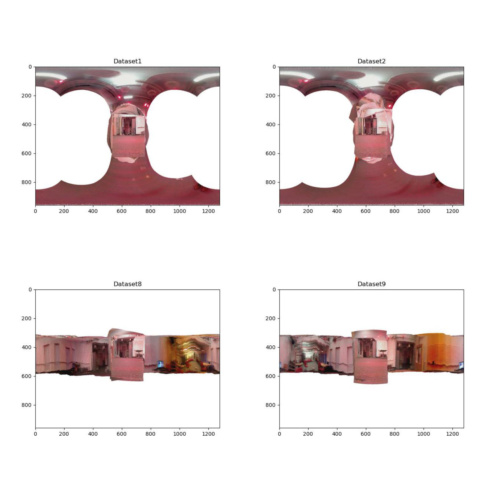
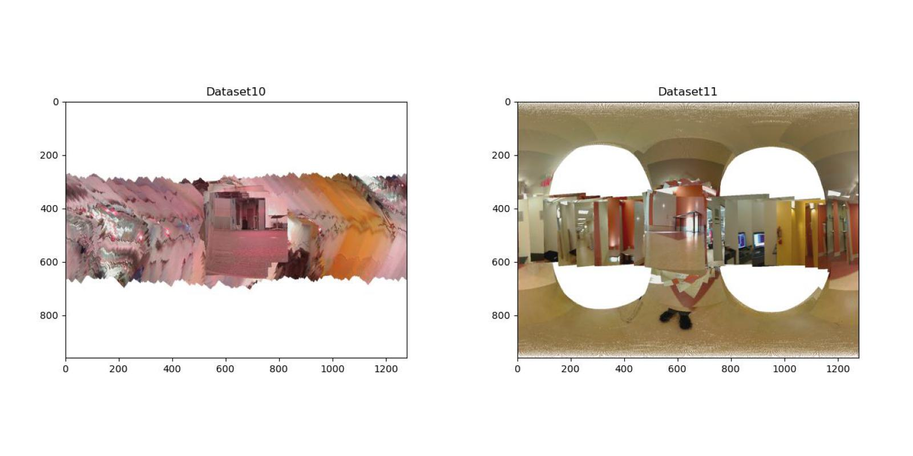
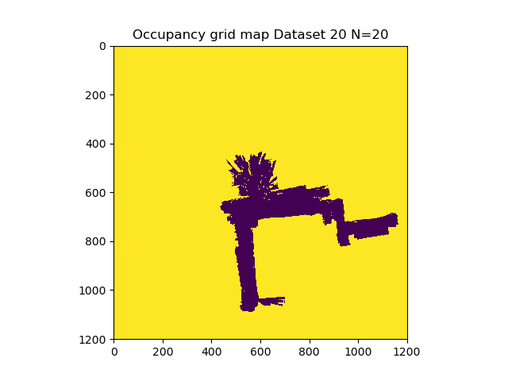
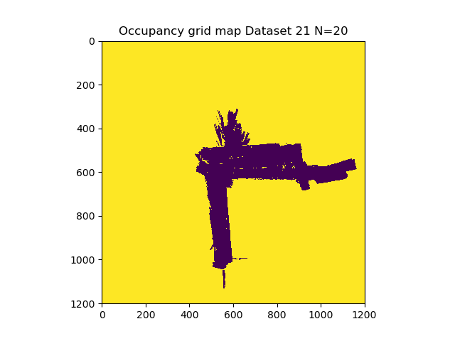
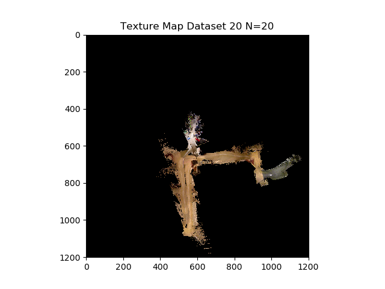
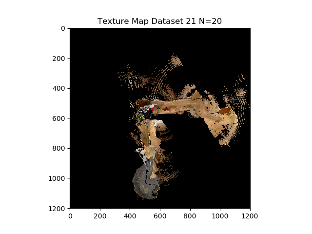
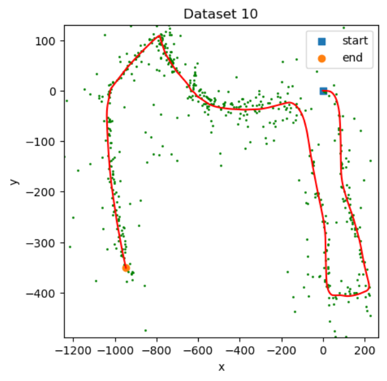
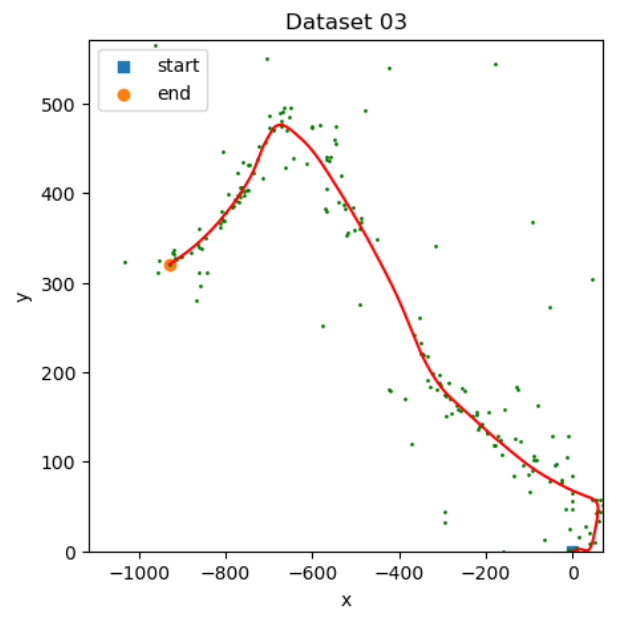

# SLAM-ECE276A
Each Project has the following folder structure.

```
├───PR
│   └───code
│   └───report.pdf
│   └───Readme.md
```

## Project 1-Orientation Tracking

I implement a projected gradient descent algorithm to track the 3-D orientation of a rotating body using
readings from an inertial measurement unit (IMU). A combination of the 3-D orientation and visual data is used to generate a panaroma




## Project 2- Particle Filter SLAM
I implement simultaneous localization and mapping (SLAM) using encoder and IMU odometry, 2-D LiDAR scans, and RGBD measurements from a differential-drive robot. Using the odometry, and LiDAR measurements, I localize the robot and build a 2-D occupancy grid map of the environment. Using the
RGBD images,  2-D map of the floor is assigned colors/texture.
Dead reckoning and Particle Filter SLAM is used.







## Project 3- Visual Intertial SLAM
I implement visual-inertial simultaneous localization and mapping (SLAM) using an extended Kalman filter
(EKF). The data provided is synchronized measurements from an inertial measurement unit (IMU) and
a stereo camera as well as the intrinsic camera calibration and the extrinsic calibration between the two
sensors, specifying the transformation from the left camera frame to the IMU frame


